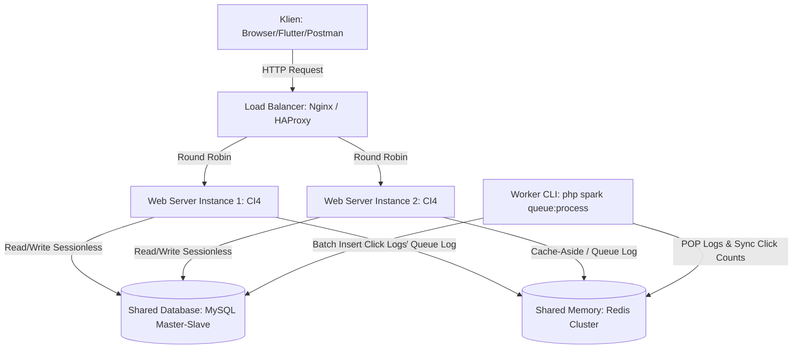

# Gazin — REST API URL Shortener (Tugas Sistem Terdistribusi)

Gazin adalah aplikasi penyingkat URL (URL Shortener) berbasis REST API stateless dengan arsitektur yang dirancang ramah sistem terdistribusi (*distributed-systems-friendly*). Dibangun menggunakan **CodeIgniter 4** (PHP), **MySQL/MariaDB**, **Redis** (sebagai cache & broker antrean), serta frontend interaktif berbasis **Alpine.js** dan **Tailwind CSS**.

---

## 1. Konsep SISTER (Sistem Terdistribusi) di Balik Gazin

Biar gak dikira sekadar web CRUD biasa sama dosen, Gazin udah dirancang pake konsep-konsep Sistem Terdistribusi yang bikin aplikasi ini siap di-scale horizontal ke banyak server. Ini penjelasan gampangnya:

### a. Stateless REST API & JWT Auth (Biar Gampang di-Scale)
Gazin itu full *stateless*. Kita gak pake `$_SESSION` bawaan PHP yang nyimpen file sesi di disk server lokal. Semua info login disimpan di client pake **JSON Web Token (JWT)**, terus dikirim lewat header `Authorization: Bearer <token>` setiap kali manggil API.
*   **Kenapa relevan sama SISTER?** Bayangin kalau kita sebar aplikasi ini ke 3 server web di belakang Load Balancer. Kalau kita pake session biasa, pas request user nyasar ke Server 2, dia bakal disuruh login lagi karena filenya cuma ada di Server 1. Dengan JWT, semua server bisa verifikasi token itu secara mandiri tanpa perlu saling nanya atau berbagi storage session.

### b. Collision-Safe Short Code (Biar Gak Tabrakan ID)
Gazin gak pake ID auto-increment database (`1, 2, 3...`) buat bikin short code-nya. Kita generate kodenya pake kombinasi **timestamp milidetik (kapan link dibuat)** + **angka acak (random offset)**, lalu di-encode ke format **Base62**.
*   **Kenapa relevan sama SISTER?** Kalau ada 5 server web nerima request buat short URL di milidetik yang sama, mereka gak bakal bentrok atau rebutan ID karena kombinasi timestamp + angka acak tadi dijamin unik (*collision-safe*) tanpa perlu nanya ke database terpusat.

### c. Cache-Aside Pattern dengan Redis (Biar Responnya Cepet)
Konsep *Cache-Aside* ini simpel: nyari data di tempat yang paling deket dan cepet dulu (yaitu Redis cache yang jalannya di RAM).
*   Pas ada user ngeklik short link, server bakal ngecek ke Redis dulu.
*   Kalau datanya ada (**Cache Hit**), langsung dialihkan (redirect) tanpa nyentuh database MySQL.
*   Kalau gak ada (**Cache Miss**), baru deh server nanya ke database MySQL (yang lambat karena di disk), terus hasilnya kita titipin ke Redis biar klik berikutnya jadi cepet banget.
*   *Anti-Crash*: Kalau Redis-nya mati, sistem otomatis langsung nanya ke MySQL tanpa bikin webnya crash (*fail-safe*).

### d. Idempotency Key Handling (Penangkal Request Ganda)
Di endpoint `POST /api/shorten`, client bisa ngirim header `Idempotency-Key` (isinya string unik, misal UUID).
*   **Kenapa relevan sama SISTER?** Di jaringan terdistribusi, koneksi itu rawan putus-nyambung. Kalau client ngirim request bikin link tapi koneksinya putus sebelum dapet respon, client biasanya bakal *retry* (kirim ulang). Tanpa Idempotency Key, link-nya bakal kebuat dua kali dengan kode berbeda (boros database). Dengan key ini, server bakal bilang: *"Oh, request yang ini tadi udah sukses kok, nih link-nya"* tanpa bikin data duplikat.

### e. Asynchronous Click Logging via Redis Queue (Biar User Gak Nunggu)
Waktu ada orang ngeklik short link, server gak langsung nulis log detailnya ke database MySQL karena nulis ke disk itu prosesnya lambat dan berat.
*   Sebagai gantinya, server cuma naikin counter klik di Redis (`INCR`) dan numpuk detail log-nya ke antrean Redis List (`LPUSH`). Proses ini kelar kurang dari 5 milidetik, dan user langsung di-redirect ke web tujuan.
*   Nanti, ada program latar belakang (*worker*) `php spark queue:process` yang bertugas mengambil antrean log tadi secara berkala dari Redis dan memasukannya secara rombongan (*batch insert*) ke MySQL.
*   **Kenapa relevan sama SISTER?** Ini memisahkan proses penting (redirect user) dari proses analitik (logging) secara asinkronus (*decoupling*), sehingga database utama gak bakal kelebihan beban (*overload*) saat web lagi viral dan diklik ribuan orang sekaligus.

---

## 2. Diagram Arsitektur (Multi-Instance Deployment)

Jika di-deploy ke produksi dengan beban tinggi, aplikasi ini siap dikonfigurasi dalam arsitektur terdistribusi seperti berikut:



---

## 3. Prasyarat Sistem
*   PHP v8.2 atau lebih tinggi
*   Ekstensi PHP: `mysqli`, `mbstring`, `intl`, `curl`, `json`
*   MySQL atau MariaDB server
*   Redis server (Opsional, untuk caching & antrean)
*   Composer installed

---

## 4. Cara Instalasi & Setup

### Langkah 1: Clone & Install Dependensi
Masuk ke direktori projek dan jalankan:
```bash
composer install
```

### Langkah 2: Konfigurasi Environment (`.env`)
Salin file `.env` (bawaan sistem sudah dikonfigurasi secara lokal):
Jika perlu menyesuaikan database dan Redis, edit baris berikut di file `.env`:
```ini
database.default.hostname = localhost
database.default.database = url_shortener
database.default.username = root
database.default.password = 

# Konfigurasi Redis
redis.host = 127.0.0.1
redis.port = 6379
```

### Langkah 3: Migrasi Database
Jalankan migrasi untuk membuat tabel `users`, `urls`, dan `click_logs`:
```bash
php spark migrate
```

### Langkah 4: Jalankan Server Lokal
Jalankan server bawaan CodeIgniter 4:
```bash
php spark serve
```
Aplikasi frontend kini dapat diakses langsung melalui browser di: **`http://localhost:8080/app/index.html`** atau **`http://localhost:8080/`** (otomatis dialihkan).

---

## 5. Menjalankan Queue Worker (Opsional - Jika menggunakan Redis)

Jika Anda memiliki Redis yang aktif, jalankan perintah CLI berikut di terminal terpisah untuk memproses antrean data kunjungan dari Redis ke MySQL secara real-time:
```bash
php spark queue:process
```
Jika ingin memproses antrean sekali saja (tidak dalam bentuk daemon looping), jalankan dengan parameter `--once`:
```bash
php spark queue:process --once
```

---

## 6. Uji Coba Concurrency & Idempotency

Untuk membuktikan bahwa sistem penanganan kunci idempotensi (*Idempotency Key*) bekerja dengan baik dari gangguan balapan request (*race conditions*), Anda dapat menjalankan script simulasi concurrent request yang mengirimkan 5 request POST secara paralel dengan kunci yang sama:

1. Pastikan server web aktif (`php spark serve`).
2. Jalankan perintah script uji coba:
```bash
php .gemini/antigravity-ide/brain/7449ddcf-77ac-4798-a61a-42b1b1f3d78e/scratch/ConcurrentTest.php
```
Script tersebut akan mengeluarkan output analisis apakah kunci idempotensi berhasil membatasi penulisan ganda sehingga hanya 1 link baru yang dibuat di database (HTTP 201) dan 4 request lainnya mendapatkan respon cache yang sama (HTTP 200).

---

## 7. Struktur REST API Endpoint

| Method | Endpoint | Deskripsi | Header Penting |
|---|---|---|---|
| **POST** | `/api/register` | Mendaftarkan pengguna baru ||
| **POST** | `/api/login` | Autentikasi & Dapatkan JWT Token ||
| **POST** | `/api/shorten` | Memperpendek URL (Dapat diakses Tamu / Pengguna) | `Idempotency-Key` (Opsional), `Authorization: Bearer <JWT>` (Opsional) |
| **GET** | `/api/urls` | Mengambil daftar URL milik user (Paginated) | `Authorization: Bearer <JWT>` |
| **PUT** | `/api/urls/{id}` | Memperbarui alias/waktu kedaluwarsa URL | `Authorization: Bearer <JWT>` |
| **DELETE** | `/api/urls/{id}` | Menghapus URL pendek & invalidasi cache | `Authorization: Bearer <JWT>` |
| **GET** | `/api/urls/{id}/stats` | Memuat analitik logs kunjungan tautan | `Authorization: Bearer <JWT>` |
| **GET** | `/{short_code}` | Akses pengalihan (Redirect) ke tujuan asli ||
